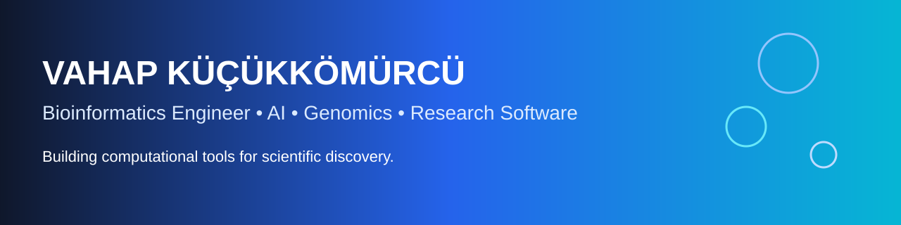

# Hi, I'm Vahap Küçükkömürcü 👋

[Portfolio](https://vahapython.github.io/Vahap-Kucukkomurcu/) •
[LinkedIn](https://www.linkedin.com/in/vahapkucukkomurcu) •
[Email](mailto:vahapkucukkomurcu@gmail.com)

---

## 🧬 About Me

Final-year Bioengineering student specializing in **Bioinformatics**.

I build research software that combines biology, AI and software engineering to make genomic analysis more accessible.

## 🚀 Featured Projects

| Project | Link |
|---|---|
| ConVarT | https://convart.org |
| CiliaMiner | https://www.ciliaminer.com |
| CiliaHub | https://www.ciliahub.org |
| Ortholog Browser | https://vahapython.github.io/C.elegans-Strain-Ortholog-Browser-Static/# |
| Portfolio | https://vahapython.github.io/Vahap-Kucukkomurcu/ |

## 🛠️ Tech Stack

## 📊 GitHub Stats

## 🔬 Research Interests

- Comparative Genomics
- Variant Interpretation
- Computational Biology
- Biomedical AI
- Scientific Visualization

## 🐍 Contribution Snake

After enabling the included workflow:

---

> **Building AI-powered bioinformatics software for genomic discovery.**
